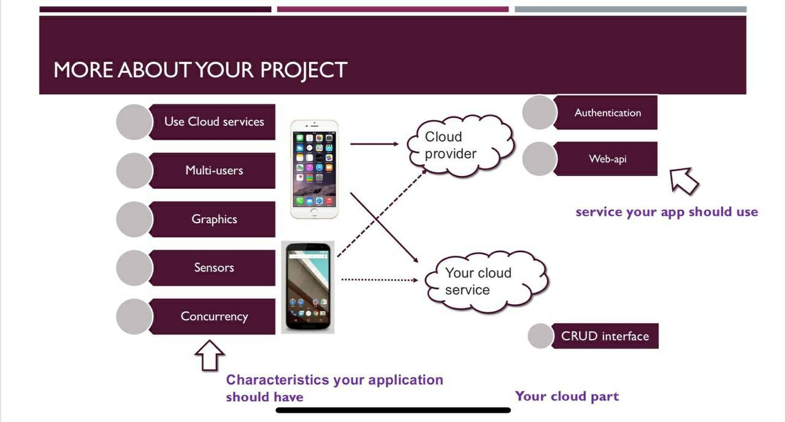
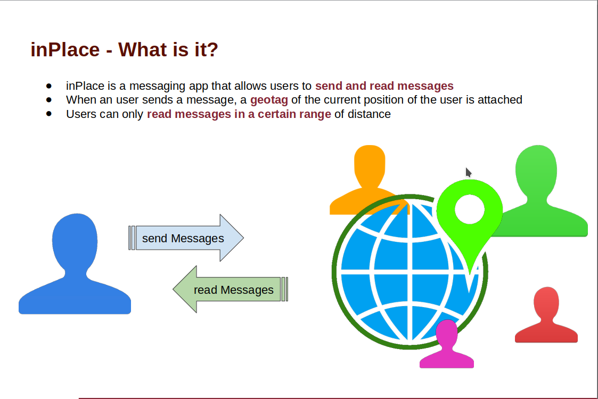
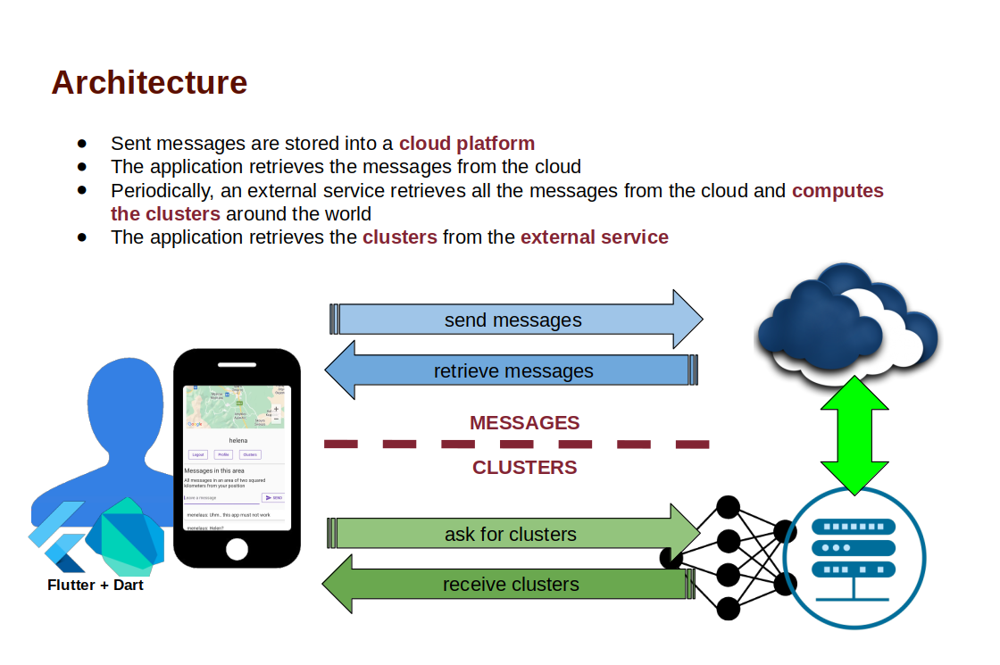
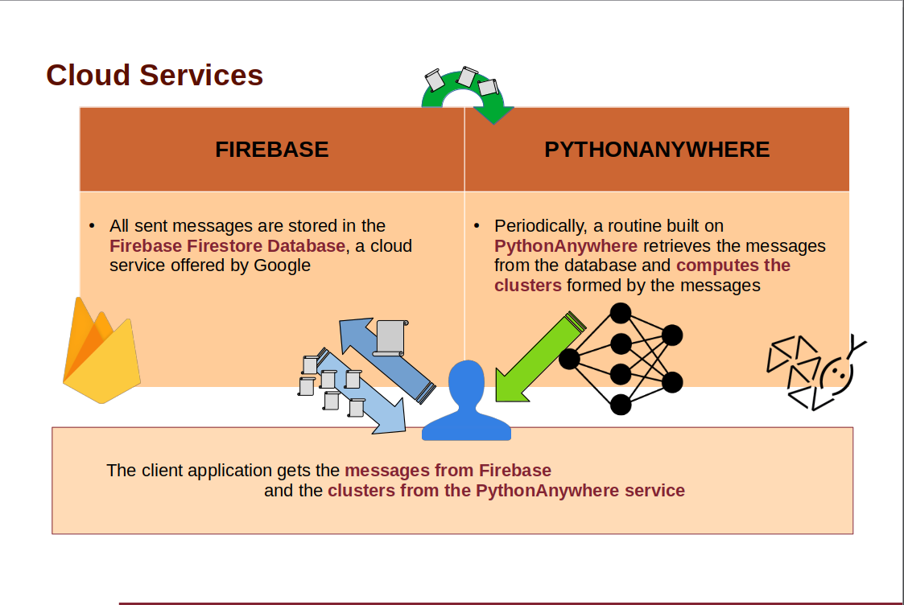
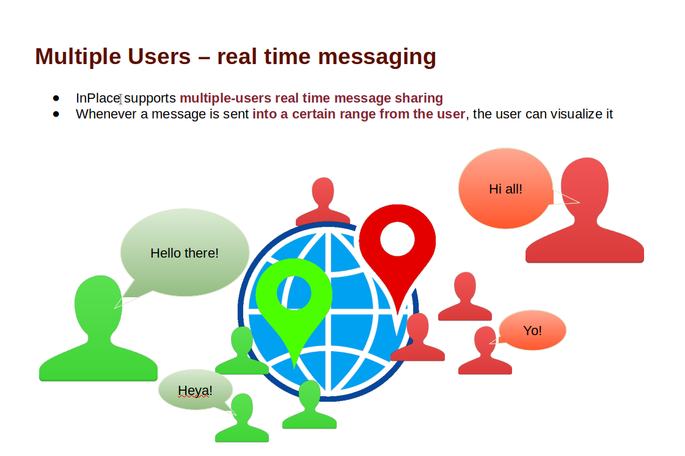
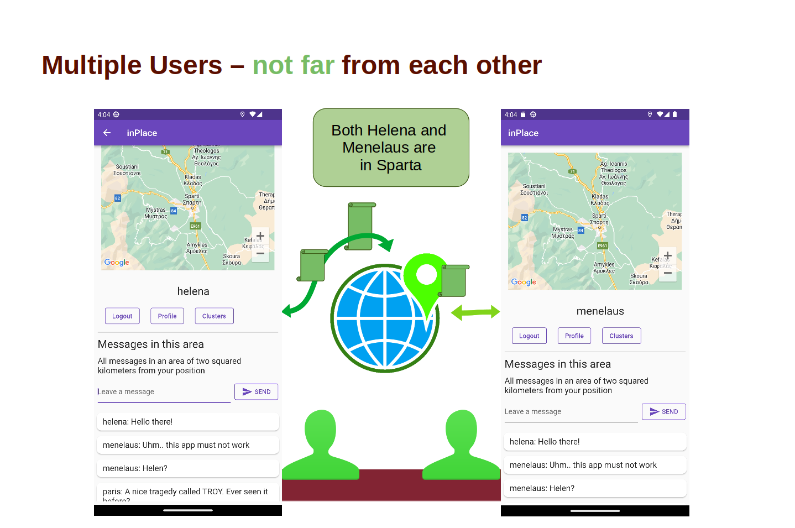
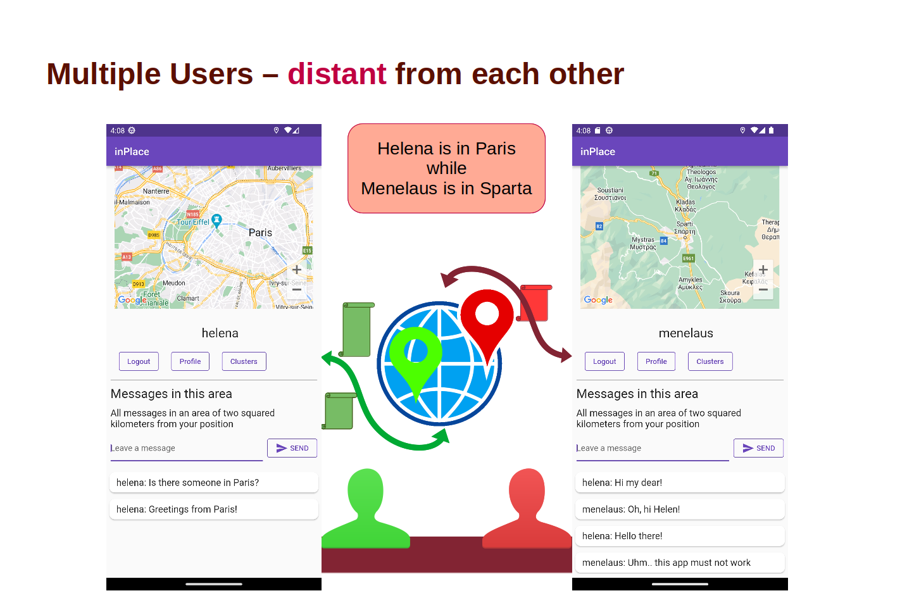
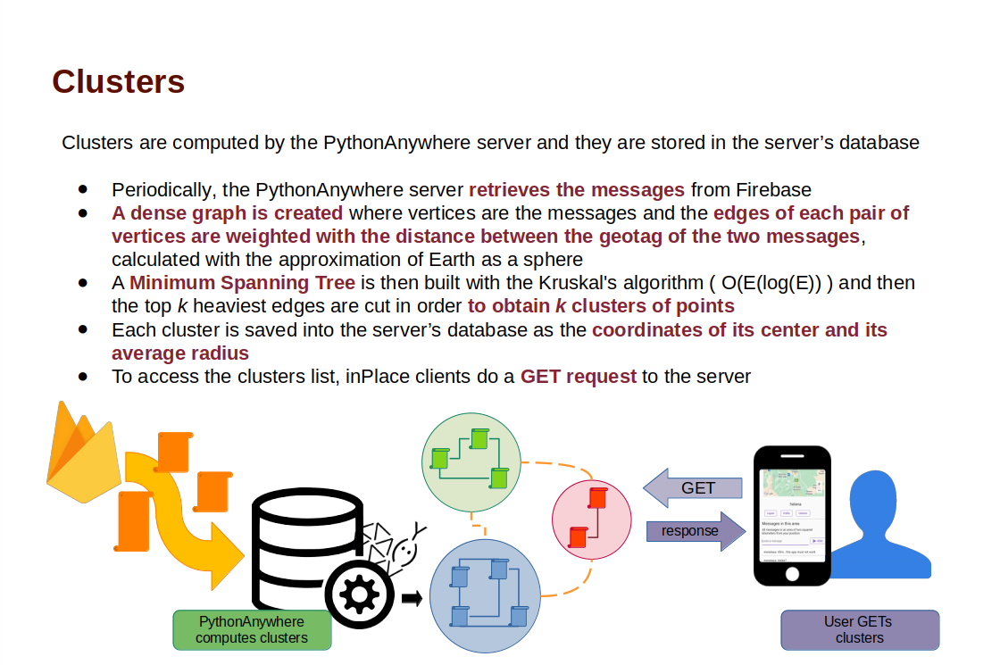
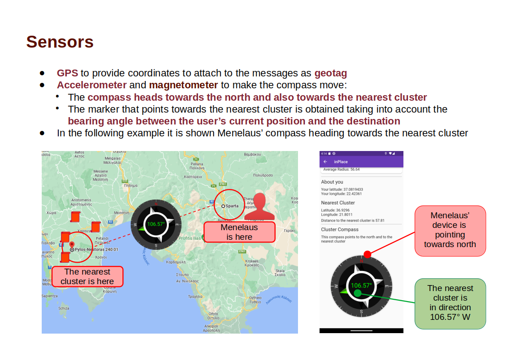

# inPlace
Project for Mobile Applications and Cloud Computing course: given a set of requirements, we had to build an application that satisfied them all. 

This project contains two main folders:

- inplace/ : here resides the application

- clustering_server/ : here there is the code used to compute the clusters

## Requirements

## About inPlace  |

## inplace/

This is the main application.

The object of the application is to create a geolocalized messaging system where an user can read and write messages that will be available only within a certain range of the position of the user.

In order to make Google Maps work you have to set up your API KEY (See [here](https://codelabs.developers.google.com/codelabs/google-maps-in-flutter#3))

Search for 'YOUR_API_KEY' in files:

-'android/app/src/main/AndroidManifest.xml'

-'web/index.html'

And replace the key

## pythonanywhere_server/

This module has to be run on a pythonanywhere. 

I uploaded it as a WebApp in the path *home/{user_name}/inPlace*.

Here the messages in the database are retrieved with their GPS coordinates, then k clusters are computed and their centers are uploaded on firestore.

After this, a rudimental API service is set up in order to give back the clusters to someone who asks.

In order to communicate with the firestore database, replace YOUR_PRIVATE_KEY in the field of "private key" in file *models/firebase_inplace_key.json*

